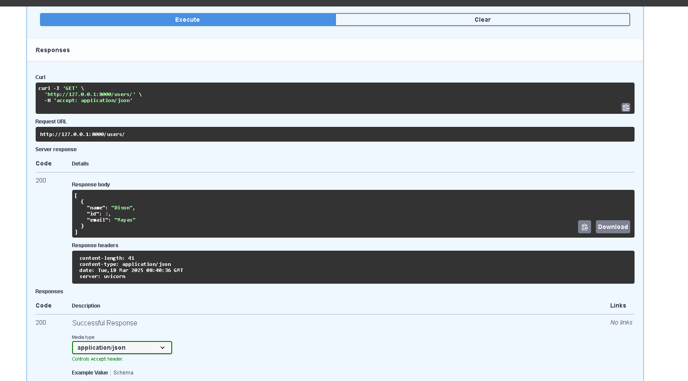
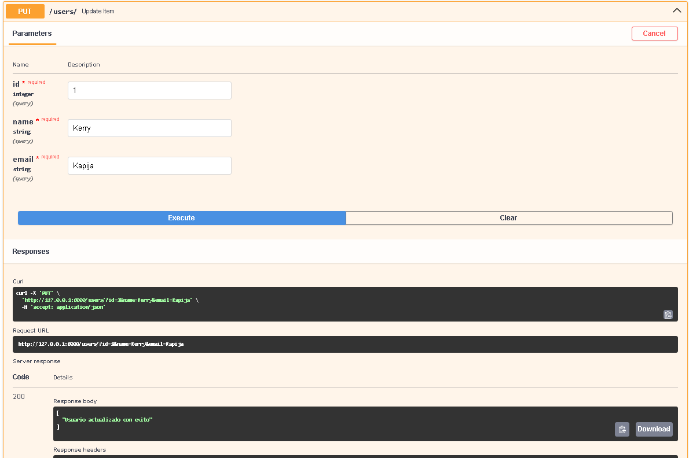
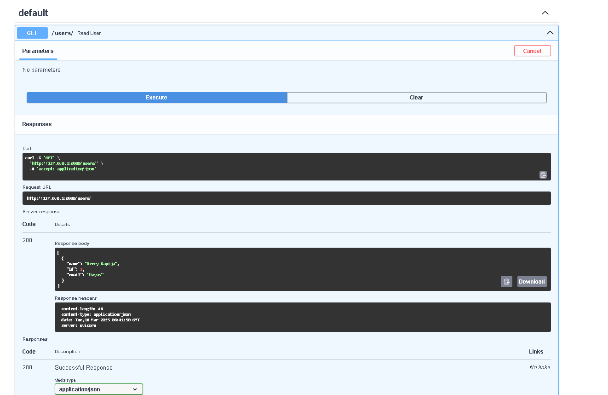
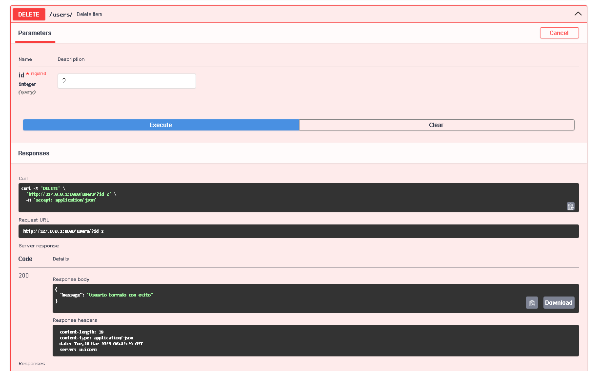
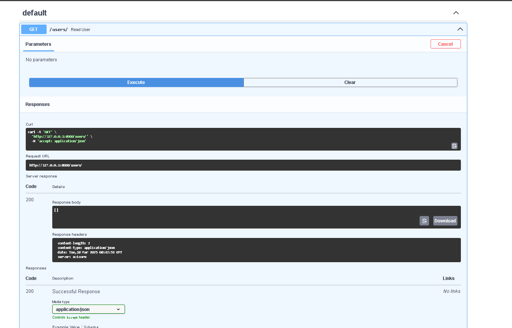

# ACTIVITAT-5-PYTHON-POSTGRESQL
</img>

# ACTIVITAT - FASTAPI + BD

<h4>Inicio de la app</h4>
</img>
<h4>Ejecución del endpoint de post add</h4>
</img>
<h4>Respuesta del endpoint en consola</h4>
</img>
<h4>Ejecución del endpoint get read(Comprobación)</h4>
</img>

# CRUD taula user
<h4>Update</h4>

-Usuario seleccionado

</img>

-Ejecución del update

</img>

-Comprobación del update

</img>
<h4>Delete</h4>

-Ejecución del delete

</img>

-Comprobación del delete

</img>

