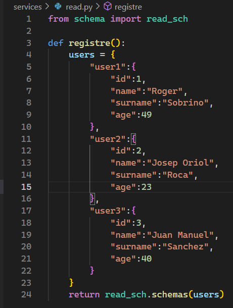

# The Bear

## ACTIVITAT - FASTAPI PRIMERES PASSES
### Creando los archivos necesarios.
#### 1. Connection.Py

Este archivo contiene la función **connection_db** que se encarga de conectarse a la base de datos y devolver la conexión.

#### 2. Schema

Este archivo contiene dos funciones, **Schema** y **Schemas**. 

**Schema** Devuelve un diccionario con los atributos del usuario mapeados.

**Schemas** Hace lo mismo que **schema** pero para varios usuarios.

#### 3. Read

Este archivo contiene la función **registre** que devuelve un diccionario con tres usuarios preestablecidos y llama a **schema** para que lo mapee.

#### 4. Main

El archivo main será el archivo que se ejecute y contiene los endpoints, en este caso esta registrado **read_root** en la ruta "/root" y se epsera que devuelva un diccionario que contiene una lista. 

### Uvicorn

Con el comando "**uvicorn main:app --reload**" iniciamos el servidor HTTP.

Finalmente entramos a **127.0.0.1:8080/docs** y ejecutamos el endpoint que tenemos.

## ACTIVITAT - FASTAPI + BD

